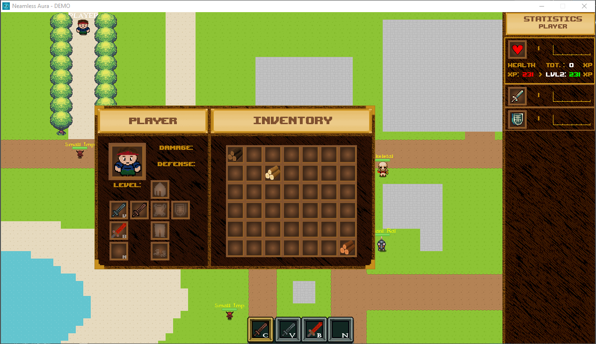

# GIP
<h1>The GIP repo for school!</h1>

This repo introduces the DEMO of Neamless Aura

**WARNING!:** The latest build can be found on my [Google Drive](http://goo.gl/VkAX5T)
      
> A 2D top-down fantasy RPG

Featuring:   
- [x] Standalone
* - [ ] Game GUI
  * - [x] In-game Debug mode
* - [ ] Scriptable:
  * - [x] Objects
  * - [x] Tiles
  * - [ ] Quests
* - [ ] Graphical Menus:
  * - [x] Main menu
  * - [x] Settings menu
    * - [x] Graphical Options
    * - [x] Game Options
  * - [ ] Game pause menu
 
Visual progress:

Main Menu

Settings Menu:

Debug Mode (Press 'D')

Latest Build:

<h2>Credits</h2>
*   [Kevin Macleod](https://incompetech.com/) - All music inc.
*   [Kevin Glass](http://www.cokeandcode.com) - Core Game
*   Matthias Zajkowski - Graphics
*   [Kenney](http://kenney.nl/) - Graphics
*   [Ravenmore](http://dycha.net) - Graphics
*   Me, yay! - Not being too lazy
